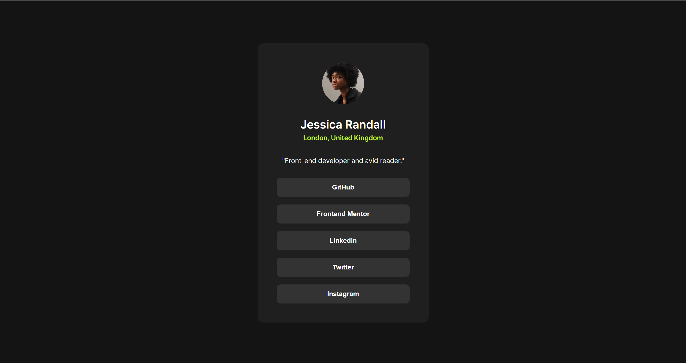

# Social links profile solution

## Table of contents

- [Overview](#overview)
  - [The challenge](#the-challenge)
  - [Screenshots](#screenshots)
  - [Links](#links)
- [My process](#my-process)
  - [Built with](#built-with)
  - [What I learned](#what-i-learned)
- [Author](#author)

## Overview

### The challenge

Users should be able to:

- See hover and focus states for all interactive elements on the page

### Screenshots

### Links

- Solution URL: [Code](https://your-solution-url.com)
- Live Site URL: [CONNECT-ON-SOCIAL-MEDIAS](https://your-live-site-url.com)

## My process

### Built with

- Semantic HTML5 markup
- CSS custom properties
- Flexbox

### What I learned

This challenge refreshed my knowledge in css property transition.

## Author

- Website - [Rinta Roy](https://www.linkedin.com/in/rinta-roy)
- Frontend Mentor - [@rinta-git](https://www.frontendmentor.io/profile/rinta-git)
